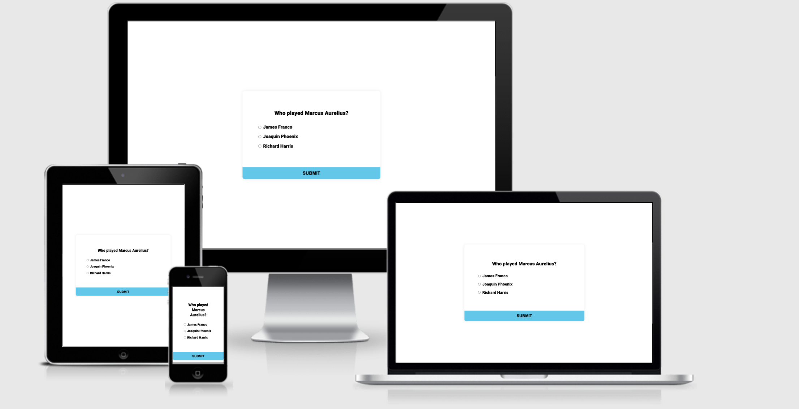
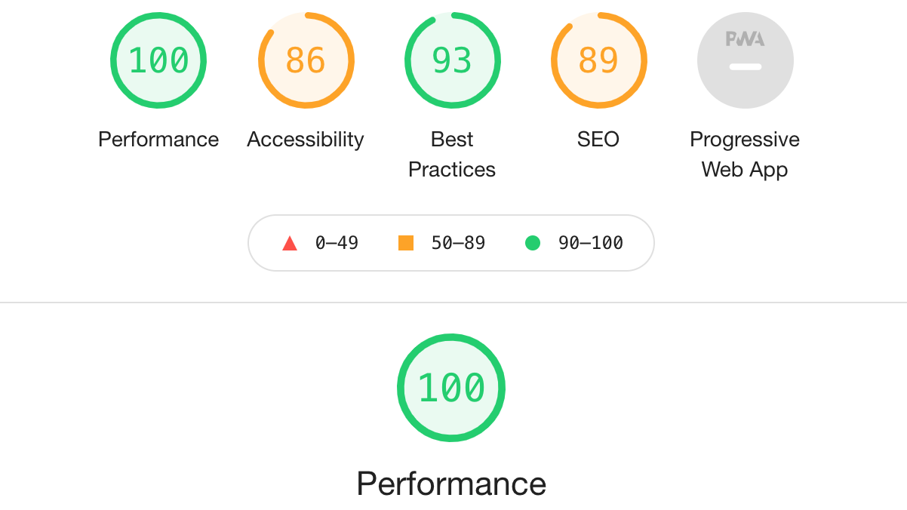

# Gladiator Quiz Game

This website is produced to test your knowledge about the movie “Gladiator”. The website contains a quiz and is daily simple. The game comes with a set five questions and three answers per question. 

Here is a link to the website: [Wasims quizgame](https://wasim-eb.github.io/quiz-game/)

The website only contains one page, which is the Home page. The game is all build in a single window at the center of the page.
This window contains different phases in the game:
- The question phase
- The ending phase
- The high score

## Technologies Used
I have used several technologies that have enabled this design to work:

- [HTML](https://developer.mozilla.org/en-US/docs/Web/HTML)
    - Used as the basic building block for the project and to structure the content.
- [CSS](https://developer.mozilla.org/en-US/docs/Learn/Getting_started_with_the_web/CSS_basics)
    - Used to style all the web content across the project. 
- [JavaScript](https://www.javascript.com/)
    - Used for the responsive navbar, animated heading, quiz functionality & sound effects and high-scores leaderboard.
- [Google Developer Tools](https://developers.google.com/web/tools/chrome-devtools)
    - Used as a primary method of fixing spacing issues, finding bugs, and testing responsiveness across the project.
- [GitHub](https://github.com/)
    - Used to store code for the project after being pushed.
- [Git](https://git-scm.com/)
    - Used for version control by utilising the Gitpod terminal to commit to Git and Push to GitHub.
- [Gitpod](https://www.gitpod.io/)
    - Used as the development environment.
- [Color Contrast Accessibility Validator](https://color.a11y.com/)
    - Allowed me to test the colour contrast of my webpage.
- [W3C Markup Validation Service](https://validator.w3.org/) 
    - Used to validate all HTML code written and used in this webpage.
- [W3C CSS Validation Service](https://jigsaw.w3.org/css-validator/#validate_by_input)
    - Used to validate all CSS code written and used in this webpage.
- [AmIResponsive](http://ami.responsivedesign.is/)
    - Used to generate responsive image used in README file.

## Features:
* A button to start the game
* Questions tab
* Answers tab, showing three possible answers.
* A button to submit your answer
* Scores at the end of the quiz
* Highscore feature

## Pages: 
There is only one page for this simple quiz-game.

## Testing
* I am happy to confirm that the website if very responsive on different browsers, such as Google Chrome (which I used to type the code), Mozilla Firefox and Internet Explorer. 
* The website was also tested live on a Samsung Galaxy 10 and iPhone 12 with great success. 
* Finally, I tested the webpage on the Responsive Design platform, also with great success. 
* The works well in function and in looks.

## Bugs
Encountered an error when typing in the questions in the javascript. 'Maximus didn’t want it' was causing me problems because of the extra ‘’ ‘ ‘’, was disturbing the code . I fixed this problem by changing the sentence into ‘Maximus did not want it’.
I later realised that this issue can also be resolved by adding a single dot to the sentence, that way it won’t interfere with the code.

## Validator testing:

* The end result shows no errors in the HTML code. Check the results here: [W3C Validator](https://validator.w3.org/nu/?doc=https%3A%2F%2Fwasim-eb.github.io%2Fquiz-game%2F)
* The CSS code is is also validated. Check the results here: [Jigsaw Validator](https://jigsaw.w3.org/css-validator/validator?uri=https%3A%2F%2Fwasim-eb.github.io%2Fquiz-game%2F&profile=css3svg&usermedium=all&warning=1&vextwarning=&lang=en)
* No errors were found neither in the HTML nor the CSS code. 
* I used lighthouse in the dev tools in Google Chrome to confirm the accessibilty on both mobile devices and desktops. 

## Unfixed bugs
No unfixed bugs.

## Deployment
I deployed this website by using GitPages and following the below steps:

### GitHub pages deployment

1. Log in to GitHub
2. In your Repository section, select the project repository that you want to deploy
3. In the menu located at the top of this section, click 'Settings'
4. Select 'Pages' on the left-hand menu - this is around halfway down
5. In the source section, select branch 'Master' and save
6. The page is then given a site URL which you will see above the source section, it will look like the following:

Please note it can take a while for this link to become fully active.

### Forking the GitHub Repository

If you want to make changes to your repository without affecting it, you can make a copy of it by 'Forking' it. This ensures your original repository remains unchanged.

1. Find the relevant GitHub repository
2. In the top right corner of the page, click the Fork button (under your account)
3. Your repository has now been 'Forked' and you have a copy to work on

### Cloning the GitHub Repository

Cloning your repository will allow you to download a local version of the repository to be worked on. Cloning can also be a great way to backup your work.

1. Find the relevant GitHub repository
2. Press the arrow on the Code button
3. Copy the link that is shown in the drop-down
4. Now open Gitpod & select the directory location where you would like the clone created
5. In the terminal type 'git clone' & then paste the link you copied in GitHub
6. Press enter and your local clone will be created.

## Credits

### Coding content
* Most of my coding was used by myself. 
* I used [W3Schools](https://www.w3schools.com/) as my main source for codes. I also had to make a lot of google searching for the javaScript content.
* I had to go back a few times and look at older coding from my previous project and I also used some codes from the Love Maths project.
